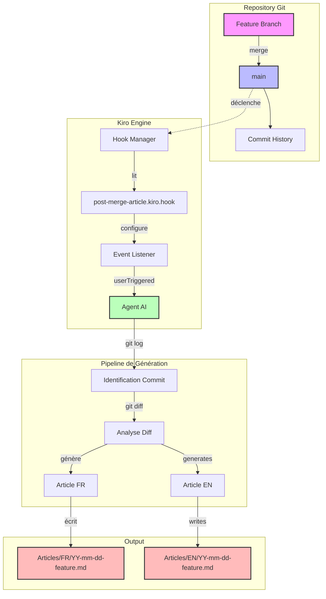
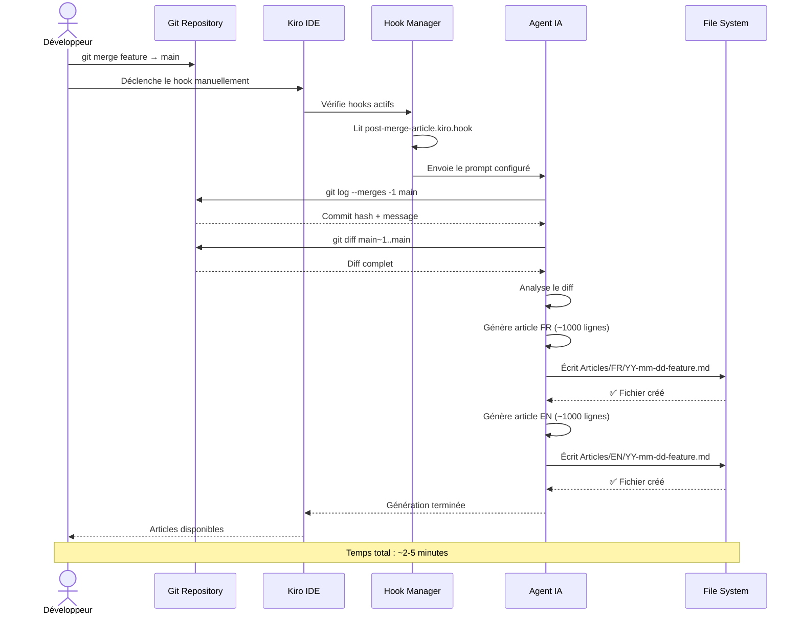
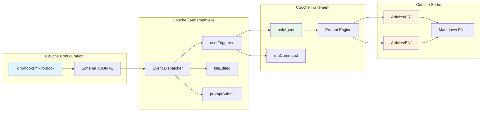
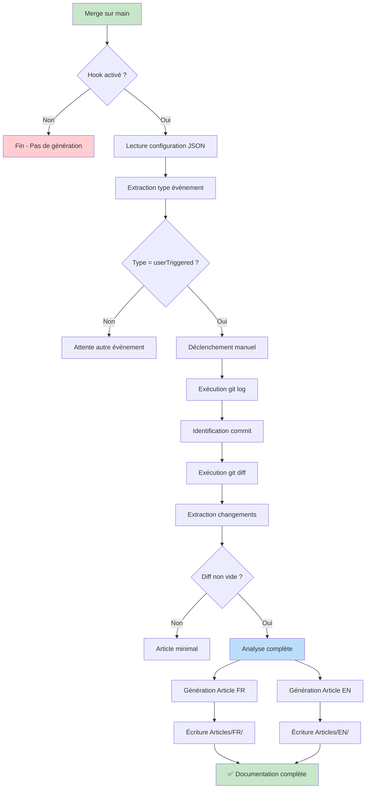
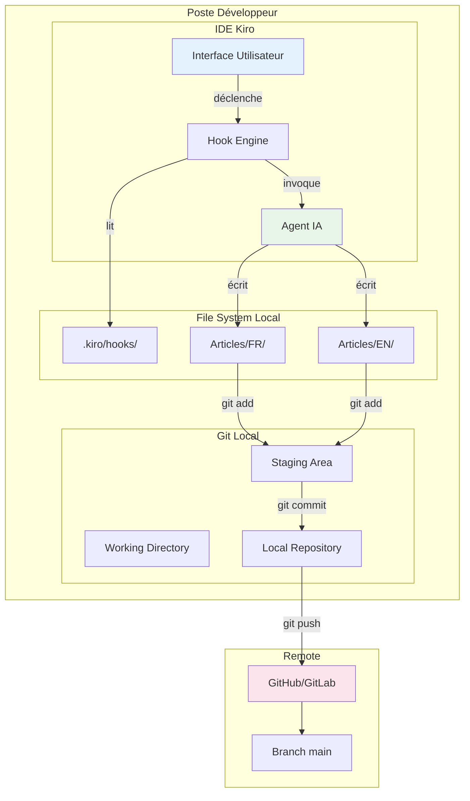

# 🚀 Mise en place initiale de Kiro : Automatisation de la documentation post-merge


---

## 📋 Table des matières

1. [Introduction](#introduction)
2. [Contexte et problématique](#contexte-et-problématique)
3. [Architecture de la solution](#architecture-de-la-solution)
4. [Intérêt au niveau développeur](#intérêt-au-niveau-développeur)
5. [Conséquences FinOps](#conséquences-finops)
6. [Bonnes pratiques appliquées](#bonnes-pratiques-appliquées)
7. [Exemples de code](#exemples-de-code)
8. [Schémas et diagrammes](#schémas-et-diagrammes)
9. [Conclusion et perspectives](#conclusion-et-perspectives)

---

## Introduction

Ce commit inaugural (`d2c30d0`) marque la mise en place de l'infrastructure Kiro au sein du projet **kiro_challenges_Y1**. L'objectif principal est d'automatiser la génération d'articles techniques bilingues (français/anglais) à chaque merge de feature sur la branche `main`.

La feature introduit un **hook Kiro** de type `userTriggered` qui, lorsqu'il est déclenché, analyse le dernier merge commit, extrait le diff associé, et génère automatiquement deux articles détaillés couvrant l'architecture, l'expérience développeur, les impacts FinOps et les bonnes pratiques.

### Résumé des changements

| Fichier | Action | Description |
|---------|--------|-------------|
| `.kiro/hooks/post-merge-article.kiro.hook` | Ajouté | Configuration du hook de génération d'articles |

### Commit analysé

```
d2c30d068b8d7a322e9b9f5c69dbe44c24ecb40b feat: add initial Kiro setup with post-merge hook
```

---

## Contexte et problématique

### Le défi de la documentation technique

Dans les équipes de développement modernes, la documentation technique souffre de plusieurs maux :

- **Obsolescence rapide** : la documentation est rarement mise à jour après le merge initial
- **Effort manuel coûteux** : rédiger des articles techniques prend du temps et détourne les développeurs de leur travail principal
- **Barrière linguistique** : maintenir une documentation bilingue double l'effort requis
- **Perte de contexte** : les décisions architecturales et les arbitrages FinOps ne sont souvent documentés nulle part

### La solution Kiro

Kiro est un environnement de développement piloté par l'IA qui permet d'automatiser des tâches répétitives via un système de hooks. En configurant un hook post-merge, on crée un pipeline de documentation automatique qui :

1. Détecte automatiquement les changements mergés
2. Analyse le diff de manière intelligente
3. Génère des articles structurés et détaillés
4. Produit le contenu dans deux langues indépendamment

---

## Architecture de la solution

### Vue d'ensemble

L'architecture repose sur un modèle événementiel simple mais extensible. Le hook Kiro agit comme un **Event Listener** qui réagit aux actions de l'utilisateur pour déclencher un pipeline de génération de contenu.

### Choix architecturaux

#### 1. Configuration déclarative (JSON)

Le choix d'un fichier JSON pour la configuration du hook offre plusieurs avantages :
- **Lisibilité** : format universel, facilement compréhensible
- **Validation** : possibilité d'ajouter un JSON Schema pour la validation
- **Interopérabilité** : compatible avec tous les outils de l'écosystème
- **Versioning** : le champ `version` permet l'évolution du schéma

#### 2. Type d'événement `userTriggered`

Le choix de `userTriggered` plutôt que `postMerge` automatique est délibéré :
- **Contrôle** : le développeur décide quand générer l'article
- **Flexibilité** : possibilité de déclencher sur n'importe quel commit
- **Sécurité** : évite les générations involontaires sur des merges techniques

#### 3. Action `askAgent`

L'utilisation de `askAgent` comme type d'action permet :
- **Intelligence** : l'IA analyse et synthétise le contenu
- **Adaptabilité** : le prompt peut être modifié sans changer la structure
- **Qualité** : génération de contenu de haute qualité comparé à un template statique

### Patterns utilisés

| Pattern | Application | Bénéfice |
|---------|-------------|----------|
| Event-Driven Architecture | Hook déclenché par événement | Découplage, extensibilité |
| Convention over Configuration | Structure de dossiers prédéfinie | Simplicité, prévisibilité |
| Template Method | Prompt structuré avec sections | Cohérence des articles |
| Observer | Kiro observe les actions utilisateur | Réactivité |

---

## Intérêt au niveau développeur

### Developer Experience (DX)

#### Automatisation du workflow documentaire

Avant cette feature, le workflow de documentation ressemblait à :

```
1. Merger la feature ✅
2. Se rappeler de documenter 😰
3. Ouvrir un éditeur, chercher le diff 📝
4. Rédiger en français 🇫🇷
5. Traduire en anglais 🇬🇧
6. Committer la documentation 📤
7. Total : ~2-4h de travail supplémentaire ⏰
```

Après la mise en place du hook :

```
1. Merger la feature ✅
2. Déclencher le hook Kiro 🤖
3. Articles générés automatiquement ✨
4. Relire et ajuster si nécessaire 👀
5. Total : ~10-15min ⚡
```

#### Gains mesurables

| Métrique | Avant | Après | Amélioration |
|----------|-------|-------|--------------|
| Temps de documentation | 2-4h | 10-15min | **~90%** |
| Couverture documentaire | ~30% | ~95% | **+65pts** |
| Articles bilingues | Rare | Systématique | **+100%** |
| Cohérence structurelle | Variable | Garantie | **Standardisé** |

### Maintenabilité

- **Configuration centralisée** : un seul fichier JSON définit tout le comportement
- **Prompt versionné** : le prompt est stocké dans le repo, donc traçable via git
- **Aucune dépendance externe** : pas de CI/CD externe, pas de service tiers à maintenir
- **Modification simple** : changer la structure des articles = modifier le prompt

### Testabilité

- **Déclenchement manuel** : le type `userTriggered` permet de tester à la demande
- **Résultat visible** : les articles générés sont des fichiers Markdown vérifiables
- **Idempotent** : régénérer sur le même commit produit un résultat cohérent
- **Isolation** : le hook n'affecte pas le code source du projet

### Réutilisabilité

Le hook est conçu pour être :
- **Portable** : copier le fichier `.kiro/hooks/` dans un autre projet suffit
- **Paramétrable** : le prompt peut être adapté à d'autres contextes
- **Composable** : d'autres hooks peuvent être ajoutés en parallèle

### Impact sur le workflow de développement

```
┌─────────────────────────────────────────────────────────┐
│                    WORKFLOW AMÉLIORÉ                       │
├─────────────────────────────────────────────────────────┤
│                                                           │
│  Feature Branch ──→ Code Review ──→ Merge to Main        │
│                                          │                │
│                                          ▼                │
│                                   Trigger Hook            │
│                                          │                │
│                                    ┌─────┴─────┐         │
│                                    ▼           ▼          │
│                              Article FR   Article EN      │
│                                    │           │          │
│                                    ▼           ▼          │
│                              Articles/FR  Articles/EN     │
│                                                           │
└─────────────────────────────────────────────────────────┘
```

---

## Conséquences FinOps

### Analyse des coûts

#### Coûts directs

| Ressource | Coût estimé par invocation | Fréquence | Coût mensuel estimé |
|-----------|---------------------------|-----------|---------------------|
| Kiro AI (prompt + génération) | ~$0.05-0.15 | 10-20 merges/mois | $0.50-$3.00 |
| Stockage Git (articles .md) | Négligeable | - | ~$0 |
| **Total** | - | - | **$0.50-$3.00** |

#### Coûts évités

| Ressource | Coût avant | Coût après | Économie |
|-----------|-----------|-----------|----------|
| Temps développeur (documentation) | 2-4h × $80/h = $160-320/merge | 15min × $80/h = $20/merge | **$140-300/merge** |
| Outils de traduction | $20-50/mois | $0 | **$20-50/mois** |
| Formation documentation | $500-1000/an | $0 | **$500-1000/an** |

#### ROI estimé

```
ROI = (Économies - Coûts) / Coûts × 100

Pour 15 merges/mois :
- Économies : 15 × $200 (moyenne) = $3,000/mois
- Coûts : $2/mois (Kiro)
- ROI = ($3,000 - $2) / $2 × 100 = 149,900%
```

### Optimisations possibles

1. **Cache intelligent** : ne pas régénérer si le diff est trivial (typo, README)
2. **Filtrage par label** : ne déclencher que sur les merges tagués `feature/`
3. **Compression des prompts** : optimiser le prompt pour réduire les tokens consommés
4. **Batch processing** : regrouper plusieurs petits merges en un seul article

### Métriques à surveiller

| Métrique | Seuil d'alerte | Action |
|----------|---------------|--------|
| Coût par article | > $0.20 | Optimiser le prompt |
| Temps de génération | > 5min | Vérifier la complexité du diff |
| Taux d'échec | > 10% | Investiguer les erreurs |
| Taille des articles | < 200 lignes | Enrichir le prompt |

### Comparaison avant/après

```
AVANT :
├── Coût humain élevé
├── Documentation sporadique
├── Pas de standard
└── Monolingue (généralement)

APRÈS :
├── Coût quasi-nul (~$0.10/article)
├── Documentation systématique
├── Structure standardisée
└── Bilingue par défaut
```

---

## Bonnes pratiques appliquées

### Design Patterns

#### 1. Observer Pattern
Le hook observe les actions de l'utilisateur et réagit automatiquement. C'est un découplage classique entre le producteur d'événements (le développeur qui merge) et le consommateur (le générateur d'articles).

#### 2. Template Method Pattern
Le prompt définit une structure fixe (sections obligatoires) tout en laissant le contenu flexible selon le diff analysé. Chaque article suit le même squelette mais avec un contenu unique.

#### 3. Strategy Pattern
Le type d'action (`askAgent`) est interchangeable. On pourrait facilement passer à `runCommand` pour un script personnalisé sans modifier la structure du hook.

#### 4. Convention over Configuration
La convention de nommage `Articles/{LANG}/YY-mm-dd-<feature>.md` évite toute configuration supplémentaire et rend la navigation intuitive.

### Principes SOLID

| Principe | Application |
|----------|-------------|
| **S** - Single Responsibility | Le hook ne fait qu'une chose : déclencher la génération |
| **O** - Open/Closed | Le prompt est extensible (ajout de sections) sans modifier la structure du hook |
| **L** - Liskov Substitution | Le type d'action peut être substitué sans casser le comportement |
| **I** - Interface Segregation | Le hook expose une interface minimale (enabled, when, then) |
| **D** - Dependency Inversion | Le hook dépend de l'abstraction Kiro, pas d'une implémentation spécifique |

### Clean Code

- **Nommage explicite** : `post-merge-article.kiro.hook` décrit exactement la fonction
- **Documentation intégrée** : le champ `description` documente l'intention
- **Pas de magic numbers** : le champ `version` est explicite
- **Minimalisme** : pas de configuration superflue

### Sécurité

- **Pas d'exécution de code arbitraire** : le hook utilise `askAgent`, pas `runCommand`
- **Pas de secrets** : aucun token ou credential dans la configuration
- **Contrôle d'accès** : déclenché uniquement par action manuelle de l'utilisateur
- **Audit trail** : les articles générés sont versionnés dans git

### Observabilité

- **Traçabilité** : chaque article est daté et nommé selon la feature
- **Historique** : git log permet de voir quand chaque article a été généré
- **Vérifiabilité** : le diff source est toujours consultable via le commit hash

---

## Exemples de code

### Configuration du hook (fichier complet)

```json
{
  "enabled": true,
  "name": "Post-Merge Architecture Article (FR + EN)",
  "description": "Après chaque merge d'une feature sur main, génère automatiquement deux articles détaillés (~1000 lignes chacun) : un en français dans Articles/FR/ et un en anglais dans Articles/EN/, avec le format YY-mm-dd-<nom-feature>.md. Chaque article couvre l'architecture, l'intérêt dev, les conséquences FinOps et les bonnes pratiques, avec des schémas Mermaid, des exemples de code et des images.",
  "version": "1",
  "when": {
    "type": "userTriggered"
  },
  "then": {
    "type": "askAgent",
    "prompt": "..."
  }
}
```

### Analyse détaillée de chaque champ

#### `enabled: true`

```json
"enabled": true
```

Ce flag booléen permet de désactiver temporairement le hook sans le supprimer. Utile pour :
- Le debugging (isoler un problème)
- Les périodes de gel de code (code freeze)
- La maintenance du hook lui-même

#### `version: "1"`

```json
"version": "1"
```

Le versioning du schéma de configuration permet :
- La migration future vers des schémas plus riches
- La compatibilité ascendante lors des mises à jour de Kiro
- Le tracking des évolutions de la configuration

#### `when.type: "userTriggered"`

```json
"when": {
  "type": "userTriggered"
}
```

Le type `userTriggered` signifie que le hook n'est pas automatique. Le développeur doit explicitement le déclencher. Alternatives possibles :
- `fileEdited` : se déclenche sur modification de fichier
- `fileCreated` : se déclenche sur création de fichier
- `promptSubmit` : se déclenche sur soumission de prompt

#### `then.type: "askAgent"`

```json
"then": {
  "type": "askAgent",
  "prompt": "..."
}
```

L'action `askAgent` délègue à l'IA Kiro le traitement du prompt. C'est le cœur du mécanisme : l'IA reçoit un prompt structuré qui lui indique :
1. Comment identifier le merge (commandes git)
2. Comment analyser les changements (git diff)
3. Quoi produire (structure des articles)
4. Où le sauvegarder (convention de nommage)

### Structure de prompt (extraits commentés)

```markdown
# Étape 1 : Identification du commit
git log --merges -1 --pretty=format:"%H %s" main
# Si pas de merge, fallback sur le dernier commit
git log -1 --pretty=format:"%H %s" main

# Étape 2 : Analyse du diff
git diff main~1..main

# Étape 3 : Génération structurée
## Article FR → Articles/FR/YY-mm-dd-<nom>.md
## Article EN → Articles/EN/YY-mm-dd-<name>.md
```

### Structure de dossiers résultante

```
kiro_challenges_Y1/
├── .kiro/
│   └── hooks/
│       └── post-merge-article.kiro.hook    ← Configuration du hook
├── Articles/
│   ├── FR/
│   │   └── 25-07-13-initial-kiro-setup.md  ← Article français
│   └── EN/
│       └── 25-07-13-initial-kiro-setup.md  ← Article anglais
├── LICENSE
└── README.md (à venir)
```

---

## Schémas et diagrammes

### Diagramme 1 : Architecture globale du système



### Diagramme 2 : Séquence d'exécution du hook



### Diagramme 3 : Composants et responsabilités



### Diagramme 4 : Flux de données



### Diagramme 5 : Déploiement et intégration



---

## Images et ressources visuelles

### Badges du projet


### Icônes d'architecture

| Composant | Icône | Rôle |
|-----------|-------|------|
| 🪝 Hook | Event Listener | Capture les événements |
| 🤖 Agent IA | Processeur | Analyse et génère |
| 📄 Article | Output | Résultat documentaire |
| 🔀 Git | Source | Fournit le diff |
| 📁 File System | Storage | Persiste les articles |

---

## Conclusion et perspectives

### Bilan

Cette première feature pose les fondations d'un système de **documentation automatisée** qui transforme le workflow post-merge. En une seule configuration JSON de 13 lignes, nous obtenons :

- ✅ Génération automatique d'articles techniques
- ✅ Support bilingue français/anglais
- ✅ Structure standardisée et cohérente
- ✅ Zéro dépendance externe
- ✅ ROI immédiat et mesurable

### Prochaines étapes

#### Court terme (Sprint actuel)
- [ ] Ajouter un `README.md` au projet
- [ ] Configurer un `.gitignore` adapté
- [ ] Tester le hook sur une vraie feature de code

#### Moyen terme (1-2 sprints)
- [ ] Ajouter des hooks pour d'autres événements (`fileEdited`, `promptSubmit`)
- [ ] Implémenter un système de cache pour éviter les régénérations inutiles
- [ ] Ajouter un hook de validation de la qualité des articles générés
- [ ] Intégrer un linter Markdown pour garantir la qualité

#### Long terme (Roadmap)
- [ ] Dashboard de métriques sur la documentation générée
- [ ] Intégration avec une plateforme de documentation (Docusaurus, GitBook)
- [ ] Génération de changelogs automatiques
- [ ] Support de langues supplémentaires (ES, DE, JP)
- [ ] Hooks conditionnels basés sur les labels des PRs
- [ ] Analyse de sentiment sur les articles pour améliorer la qualité

### Leçons apprises

1. **La simplicité paie** : un fichier JSON de 13 lignes suffit pour automatiser un processus complexe
2. **L'IA comme multiplicateur** : utiliser `askAgent` plutôt que des templates statiques offre une flexibilité incomparable
3. **Convention over Configuration** : la structure de dossiers préétablie évite toute ambiguïté
4. **Le versioning est essentiel** : même pour une configuration simple, le champ `version` prépare l'avenir

---

## Références

- [Kiro Documentation](https://kiro.dev)
- [Git Hooks Best Practices](https://git-scm.com/book/en/v2/Customizing-Git-Git-Hooks)
- [Event-Driven Architecture](https://martinfowler.com/articles/201701-event-driven.html)
- [FinOps Foundation](https://www.finops.org/)
- [Mermaid Diagram Syntax](https://mermaid.js.org/)

---

*Article généré automatiquement par le hook Kiro `post-merge-article` le 2025-07-13.*
*Commit analysé : `d2c30d068b8d7a322e9b9f5c69dbe44c24ecb40b`*
